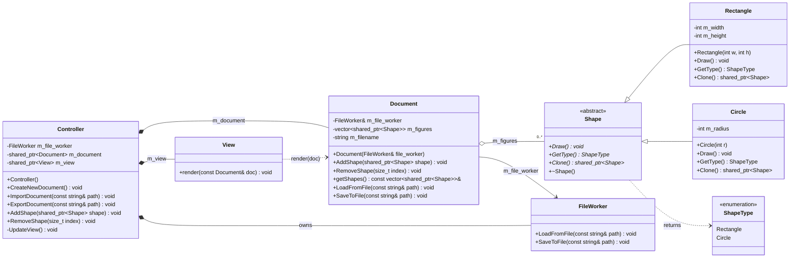
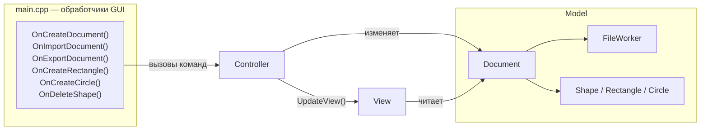
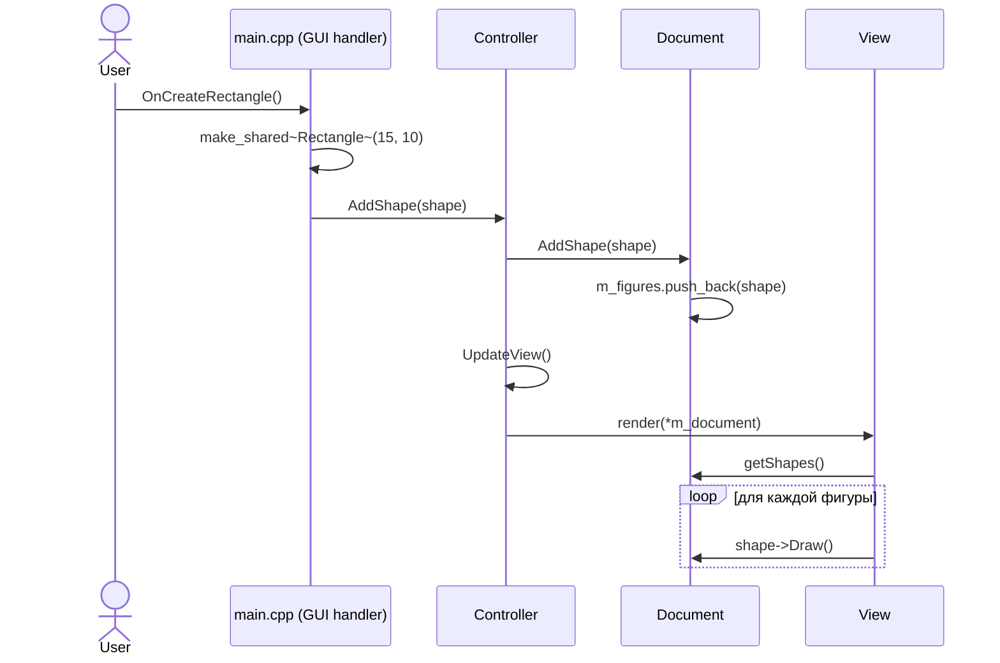
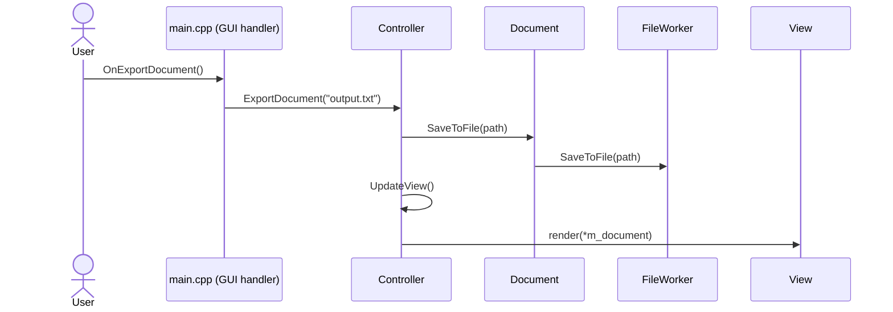

# UML-диаграммы графического редактора

## Диаграмма классов

```mermaid
classDiagram
    direction LR

    class Shape {
        <<abstract>>
        +Draw()* void
        +GetType()* ShapeType
        +Clone()* shared_ptr~Shape~
        +~Shape()
    }

    class ShapeType {
        <<enumeration>>
        Rectangle
        Circle
    }

    class Rectangle {
        -int m_width
        -int m_height
        +Rectangle(int w, int h)
        +Draw() void
        +GetType() ShapeType
        +Clone() shared_ptr~Shape~
    }

    class Circle {
        -int m_radius
        +Circle(int r)
        +Draw() void
        +GetType() ShapeType
        +Clone() shared_ptr~Shape~
    }

    class FileWorker {
        +LoadFromFile(const string& path) void
        +SaveToFile(const string& path) void
    }

    class Document {
        -FileWorker& m_file_worker
        -vector~shared_ptr~Shape~~ m_figures
        -string m_filename
        +Document(FileWorker& file_worker)
        +AddShape(shared_ptr~Shape~ shape) void
        +RemoveShape(size_t index) void
        +getShapes() const vector~shared_ptr~Shape~~&
        +LoadFromFile(const string& path) void
        +SaveToFile(const string& path) void
    }

    class View {
        +render(const Document& doc) void
    }

    class Controller {
        -FileWorker m_file_worker
        -shared_ptr~Document~ m_document
        -shared_ptr~View~ m_view
        +Controller()
        +CreateNewDocument() void
        +ImportDocument(const string& path) void
        +ExportDocument(const string& path) void
        +AddShape(shared_ptr~Shape~ shape) void
        +RemoveShape(size_t index) void
        -UpdateView() void
    }

    Shape <|-- Rectangle
    Shape <|-- Circle
    Shape ..> ShapeType : returns

    Document o-- "0..*" Shape : m_figures
    Document --> FileWorker : m_file_worker

    Controller *-- FileWorker : owns
    Controller *-- Document : m_document
    Controller *-- View : m_view

    View ..> Document : render(doc)
```

## Структура MVC

```mermaid
flowchart LR
    subgraph GUI["main.cpp — обработчики GUI"]
        H["OnCreateDocument()\nOnImportDocument()\nOnExportDocument()\nOnCreateRectangle()\nOnCreateCircle()\nOnDeleteShape()"]
    end

    subgraph Model["Model"]
        D[Document]
        F[FileWorker]
        S["Shape / Rectangle / Circle"]
    end

    C[Controller]
    V[View]

    H -->|"вызовы команд"| C
    C -->|"изменяет"| D
    D --> F
    D --> S
    C -->|"UpdateView()"| V
    V -->|"читает"| D
```

## Диаграмма последовательности: добавление примитива

```mermaid
sequenceDiagram
    actor User
    participant main as main.cpp (GUI handler)
    participant Controller
    participant Document
    participant View

    User->>main: OnCreateRectangle()
    main->>main: make_shared~Rectangle~(15, 10)
    main->>Controller: AddShape(shape)
    Controller->>Document: AddShape(shape)
    Document->>Document: m_figures.push_back(shape)
    Controller->>Controller: UpdateView()
    Controller->>View: render(*m_document)
    View->>Document: getShapes()
    loop для каждой фигуры
        View->>Document: shape->Draw()
    end
```

## Диаграмма последовательности: экспорт документа

```mermaid
sequenceDiagram
    actor User
    participant main as main.cpp (GUI handler)
    participant Controller
    participant Document
    participant FileWorker
    participant View

    User->>main: OnExportDocument()
    main->>Controller: ExportDocument("output.txt")
    Controller->>Document: SaveToFile(path)
    Document->>FileWorker: SaveToFile(path)
    Controller->>Controller: UpdateView()
    Controller->>View: render(*m_document)
```
